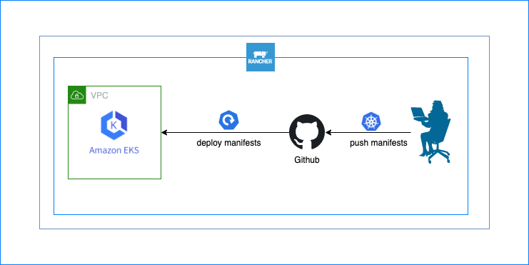

# Continuous Delivery with Rancher

**How to implement Continuous Delivery with Rancher using Github as CI, Github Actions for testing, Rancher as CD and deploy to AWS EKS Cluster** 

## Push k8s manifests to Guthub repo and it automatically deploys it in AWS EKS Cluster.

