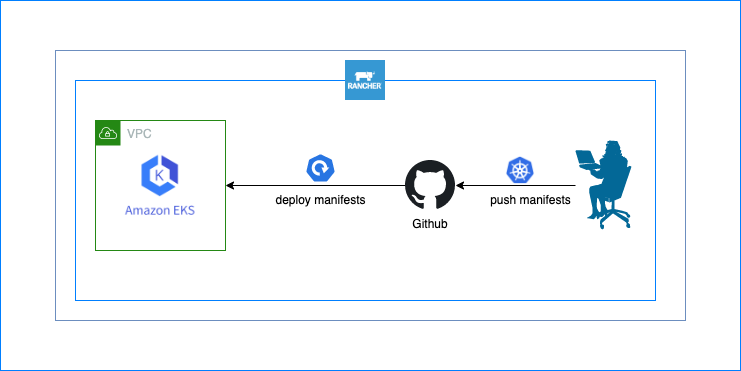

**Continuous Delivery with Rancher**  

How to implement Continuous Delivery with Rancher using Github, AWS EKS Cluster and Rancher.

Push k8s manifests to Guthub repo and it automatically deploys it in AWS EKS Cluster.

