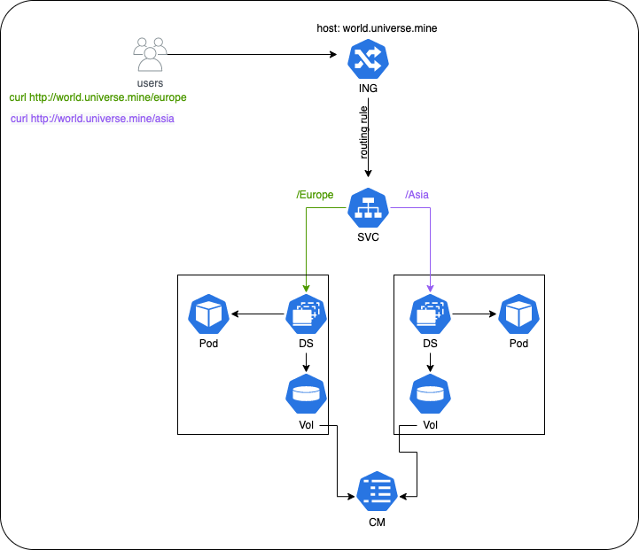

# Ingress Routing to Multiple Services
Using Ingress to route to 2 different services based on path




## Ingress Controller 
-- Nginx Ingress Controller was used for this sample. 

## creating the host record in node(s)
`vim /etc/hosts`

add record below:
```
<node_IP> world.universe.mine
```

## get node(s) IP
kubectl get pods -o wide